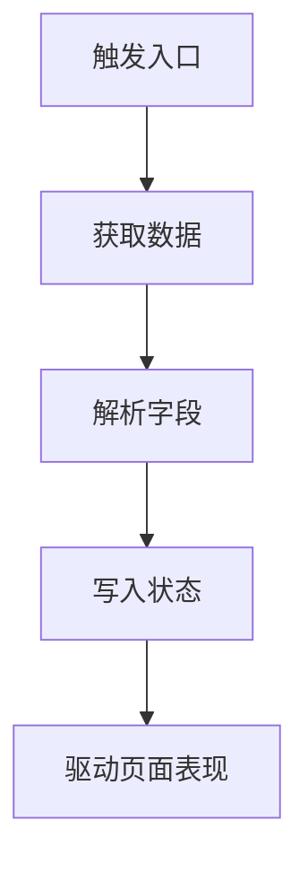

# 需求文档

本目录用于维护项目长期有效的项目级需求 / 实现知识库。

每个 `.md` 文件代表一个稳定功能、业务模块或实现机制，用来说明它是什么、当前需求规则是什么、最终如何实现、涉及哪些代码和关键逻辑。

## 为什么放在项目里

需求文档是项目契约，不是某个 AI 工具的临时上下文。

- **跟项目版本一起演进**：每个项目的业务规则、实现约定和文档命名都可能不同，应随代码一起提交、评审和更新。
- **人和 AI 都能读**：开发人员、Code Review、不同 AI 工具都可以直接读取项目文档，不依赖某台机器上的全局 skill。
- **模板项目可复制约定**：本项目作为前端模板时，新项目可以直接继承这套需求 / 实现知识库结构。
- **降低隐性上下文依赖**：重要业务规则不只存在于对话、全局配置或本机 skill 中，避免换工具或换人后丢失背景。

## 何时需要维护

以下任务必须检查并按需创建或更新本目录下的功能文档：

- 新功能、新页面、新交互。
- 接口联调、字段含义、请求参数或响应结构变化。
- 表单规则、提交逻辑、回显逻辑变化。
- Store、权限、菜单、路由、按钮控制等业务逻辑变化。
- 组件职责、组件拆分、composable 抽取或实现方案变化。
- 影响开发人员理解功能的业务规则变化。

如果本次任务不改变需求，也不改变实现方案，可以不修改需求文档，但需要在回复中说明原因。

## 文档归属规则

一次任务可以影响多个需求文档；一个需求文档也不应该承载一次任务中的所有内容。

维护需求文档时必须按功能、业务模块或实现机制归属拆分：

- 每个需求文档只记录属于该功能、业务模块或实现机制的当前事实。
- 如果一次任务影响多个功能，必须分别创建或更新多个对应文档。
- 禁止把与当前文档主题无关的需求、接口、状态、组件或实现细节写入该文档。
- 如果出现跨模块共用机制，应优先写入对应的机制文档，例如 `permission.md`、`menu.md`、`request.md`、`routing.md`，再在业务功能文档中简要引用。
- 如果找不到合适的既有文档，应创建新的稳定功能文档，而不是临时塞进相近文档。
- 如果文档归属不确定，必须先询问用户，不得自行合并到某个文档。

## 命名规则

除本 README 外，功能文档使用平级 Markdown 文件，不按日期建目录。

文件名使用稳定的英文业务名，推荐 kebab-case。文件名应表达功能或业务域，而不是某次任务。

示例：

```text
permission.md
user-center.md
menu.md
login.md
```

如果一个功能已有对应文档，必须更新原文档，不要重复创建新文件。

## 内容结构

每个功能文档推荐使用以下结构。根据功能复杂度可以删减，但不要保留空章节。

````markdown
# 功能中文名 english-name

## 功能概述

说明这个功能是什么，解决什么问题，影响哪些页面、菜单、按钮、路由、接口或状态。

## 当前结论

- 数据来源：
- 接口：
- 关键字段：
- 存储位置：
- UI 表现：
- 异常降级：

## 需求规则

按业务规则拆分小节，说明当前最终规则。

## 边界场景

- 未登录：
- 接口失败：
- 空数据：
- 字段缺失：
- 刷新页面：
- 退出登录：

## 实现方案

### 数据流



### 涉及文件

- `src/path/example.ts`：说明职责。
- `src/path/Example.vue`：说明职责。

### 核心逻辑

说明关键判断、状态流转、组件职责、接口封装和降级处理。

## 关键决策

只记录仍然影响当前实现的关键取舍。没有关键取舍时删除本节。
````

## 维护原则

- 文档正文应描述当前最终状态，不做流水账式追加。
- 需求变化时，直接修改“需求规则”“边界场景”等章节。
- 实现方案变化时，直接修改“实现方案”“涉及文件”“核心逻辑”等章节。
- 只要本次创建或修改了需求文档，必须按文档告知用户文档路径和变更要点，并等待用户确认后才能进入下一步。
- 长期有效的取舍写入“关键决策”；普通历史变化不需要记录。
- 不维护测试或验收章节；测试流程后续由单独规范承载。
- 文档中不得保留无意义的 `TODO`、`TBD` 或未确认占位内容。

功能文档以本目录下的实际文件列表为准，本 README 不维护手工索引。
